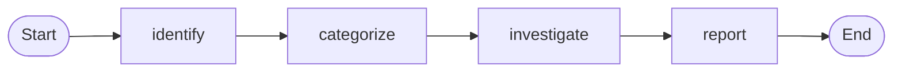

# Part 3 — Graph nodes + skill-as-tool (implementation plan)

**Status:** Planned (not yet implemented)  
**Prerequisite:** Parts 1 and 2 workshop flow stable  
**Last updated:** 2026-06-30

This document captures the agreed redesign for Part 3: replace the single ReAct loop (borrowed from Part 1) with a **four-node LangGraph workflow**, and expose playbooks via **skill-as-tool** (`load_skill` / `list_skills`) while keeping `skills/` as the source of truth.

---

## Goals

| Goal | Why |
|------|-----|
| Enforce workflow order | identify → categorize → investigate → report (matches `troubleshoot/SKILL.md`) |
| Reliable product routing | Categorization in **code**, not LLM prose |
| On-demand playbooks | Load full product/report skills when needed; avoid stuffing all skills into the system prompt |
| Keep markdown skills | Facilitators and SREs continue editing `skills/*/SKILL.md` |
| Preserve integrations | Slack listener, MCP, Galileo, OTel unchanged at the `run_chat` boundary |

## Non-goals (for this effort)

- Changing Part 1 or Part 2 architecture
- Replacing MCP tools with custom API clients
- Running skill helper scripts (e.g. `parse_alerts_response.py`) automatically — document or add a separate tool if needed later
- Multi-agent specialist sub-agents per product (single **investigate** node instead)

---

## Current state (baseline)

```
part3_agent/agent.py
  → build_system_prompt() injects troubleshoot/SKILL.md only
  → build_agent_graph() from part1_agent (single ReAct loop)
  → get_tools() = builtins + MCP

Product skills (APM, IM, RUM, Synthetics, report) exist on disk but are NOT loaded at runtime.
```

See `skill_router.py`, `prompt.py`, and `skills/troubleshoot/SKILL.md`.

---

## Target architecture

### Graph (4 nodes)

```
START → identify → categorize → investigate → report → END
```



**One investigate node for all products.** The categorize node sets `product_type`; investigate loads the matching skill programmatically (not via separate graph branches).

### Two layers

| Layer | Responsibility |
|-------|----------------|
| **Graph nodes** | Step order, state passing, retries/limits, observability tags |
| **Skills (tools + loader)** | Detailed RCA instructions, report format, MCP call guidance |

### Skill-as-tool

| Tool | Purpose |
|------|---------|
| `list_skills()` | Return name + description catalog (from YAML frontmatter) |
| `load_skill(skill_name, include_reference=False)` | Return full `SKILL.md` body; optionally append `reference.md` |

**Recommended pattern inside nodes:**

- **categorize** → pure Python (no skill tool required)
- **investigate** → **code** calls `load_skill_content(skill_name)` before the ReAct sub-loop (deterministic); optionally also expose `load_skill` to the LLM for `reference.md` or edge cases
- **report** → code loads `troubleshoot-report` before formatting

Exposing tools to the LLM is still useful for identify (e.g. `get-alerts-or-incidents`) and workshop transparency; the critical product skill load should not depend on the model remembering to call it.

---

## Shared graph state (draft)

```python
# TypedDict or Pydantic model — finalize during implementation
class Part3State(TypedDict):
    messages: Annotated[list[BaseMessage], add_messages]  # if using message-reducer pattern

    # Inputs
    user_message: str
    investigation_metadata: dict[str, str] | None

    # identify
    alert_payload: dict | None          # parsed alert JSON
    alert_load_error: str | None        # if search failed

    # categorize
    product_type: str | None            # apm | im | rum | synthetics | unknown
    skill_name: str | None              # e.g. troubleshoot-apm-incidents

    # investigate
    investigation_summary: str | None
    skills_loaded: list[str]

    # report
    final_report: str | None
```

Adjust fields to match LangGraph patterns used elsewhere in the repo.

---

## Node specifications

### 1. `identify`

**Type:** LLM sub-loop + MCP tools (small ReAct inside the node)

**Purpose:** Fetch full alert payload per `get-alerts-or-incidents` / `troubleshoot` §1.

**Behavior:**

- Optionally preload `load_skill("get-alerts-or-incidents")` into node context (code or tool).
- Call `o11y_search_alerts_or_incidents` with correct `params` (`detector_id`, `service_name`, `time_range`, etc.).
- Parse and store `alert_payload` in state; set `alert_load_error` if not found.
- Slack: use `investigation_metadata` (`eventId`, service, environment) when present.

**Exit:** Always → `categorize` (even on failure; report node handles gaps).

---

### 2. `categorize`

**Type:** Deterministic Python (no LLM)

**Purpose:** Map alert → product type using rules from `skills/troubleshoot/reference.md`.

**Behavior:**

- Input: `alert_payload` (or empty).
- Output: `product_type`, `skill_name` via fixed mapping:

  | product_type | skill_name |
  |--------------|------------|
  | apm | troubleshoot-apm-incidents |
  | im | troubleshoot-im-incidents |
  | rum | troubleshoot-rum-incidents |
  | synthetics | troubleshoot-synthetics-incidents |
  | unknown | fallback policy (see below) |

**Fallback for `unknown`:** Pick one and document in code:

- Load a generic/minimal investigate prompt, or
- Load `troubleshoot` reference only and let investigate improvise, or
- Short-circuit to report with “could not categorize” (safest for demo)

**Exit:** → `investigate`

---

### 3. `investigate`

**Type:** LLM sub-loop + MCP tools (main ReAct loop)

**Purpose:** RCA using the product-specific playbook.

**Behavior:**

1. `playbook = load_skill_content(state.skill_name)` (code, not LLM).
2. Build node system prompt: base Part 3 prompt + playbook + condensed alert summary.
3. Run ReAct with MCP tools (`o11y_*`, Splunk MCP if enabled).
4. Enforce `recursion_limit` / max turns for this node only.
5. Write `investigation_summary` and append `skill_name` to `skills_loaded`.

**Optional:** Expose `load_skill` as an LLM tool for secondary playbooks (`reference.md`, correlating IM from APM, etc.).

**Exit:** → `report`

---

### 4. `report`

**Type:** LLM (light loop or single call)

**Purpose:** Structured output per `troubleshoot-report`.

**Behavior:**

1. `playbook = load_skill_content("troubleshoot-report")`.
2. Input context: alert payload, product type, investigation summary, tool evidence from messages.
3. Produce `final_report` string returned to user / Slack.

**Exit:** → END

---

## Proposed file layout (after implementation)

```
part3_agent/
  agent.py                 # run_chat → compile & invoke Part 3 graph (not part1 graph)
  graph.py                 # NEW: 4 nodes, edges, state, compile()
  skill_tools.py           # NEW: load_skill_content, list_skills, LangChain @tool wrappers
  skill_categorizer.py     # NEW: alert JSON → product_type + skill_name
  skill_router.py          # REFACTOR: shared parsing; optional catalog for base prompt
  prompt.py                # Base prompts; per-node prompt fragments if needed
  skills/                  # UNCHANGED structure; light edits to SKILL.md wording
  IMPLEMENTATION_PLAN.md   # this file
```

**Part 1 `build_agent_graph`:** Keep as-is for Part 1. Part 3 may reuse a helper like `build_react_subgraph(tools, system_prompt)` extracted to shared or `part3_agent/graph.py`.

---

## Implementation phases

Implement in order; each phase should keep tests green.

### Phase 1 — Skill loader (no graph yet)

- [ ] Create `skill_tools.py`: parse/reuse logic from `skill_router.py`
- [ ] `load_skill_content(name, include_reference=False)` with allowlist + `MAX_SKILL_CHARS`
- [ ] `list_skills()` catalog from frontmatter
- [ ] LangChain tools `load_skill`, `list_skills` for LLM use
- [ ] Tests: `tests/part3/test_skill_tools.py`
- [ ] Wire tools into current Part 3 agent temporarily (optional) OR leave unwired until Phase 3

### Phase 2 — Categorizer

- [ ] Create `skill_categorizer.py` from `troubleshoot/reference.md` rules
- [ ] `categorize_alert(alert: dict) -> CategorizationResult`
- [ ] Tests with fixture alerts per product (APM, IM, RUM, Synthetics, unknown)

### Phase 3 — Graph skeleton

- [ ] Create `graph.py` with state schema and 4 stub nodes (pass-through)
- [ ] `agent.py` invokes Part 3 graph instead of `part1_agent.build_agent_graph`
- [ ] Smoke test: graph runs end-to-end with mocked LLM/MCP

### Phase 4 — Node implementation

- [ ] **identify** — MCP alert search, state population
- [ ] **categorize** — call categorizer (no LLM)
- [ ] **investigate** — code-load product skill + ReAct + MCP
- [ ] **report** — code-load report skill + format

### Phase 5 — Polish

- [ ] Observability: log node transitions, `product_type`, `skills_loaded` in OTel/Galileo metadata
- [ ] Tune `recursion_limit` per node (investigate needs the most)
- [ ] Update `prompt.py` and skill markdown (explicit `load_skill` where relevant)
- [ ] Update `README.md` with new architecture diagram
- [ ] Integration tests behind existing pytest markers

### Phase 6 — Cleanup

- [ ] Slim `skill_router.build_system_prompt` (catalog or minimal base; graph owns orchestration)
- [ ] Remove duplicate/stale `Part3-Agent/` tree if still present in repo
- [ ] Workshop demo script: Part 1 → Part 2 → Part 3 (structured graph)

---

## Skill markdown updates (light touch)

| File | Change |
|------|--------|
| `skills/troubleshoot/SKILL.md` | Note that runtime graph implements §workflow; skill remains the spec |
| Product skills | Optional: “loaded by investigate node after categorization” |
| `skills/troubleshoot/SKILL.md` §3 | Reference `skill_name` mapping used by categorizer |

Do not rewrite playbooks; align wording with graph behavior.

---

## Testing strategy

| Level | What |
|-------|------|
| Unit | `load_skill_content`, allowlist, truncation, `include_reference` |
| Unit | `categorize_alert` with JSON fixtures |
| Unit | `product_type` → `skill_name` mapping |
| Graph | Mock LLM: assert node order identify → categorize → investigate → report |
| Graph | Mock MCP: identify stores payload; investigate receives correct preloaded skill |
| Integration | Live MCP + Ollama/Azure (existing markers) |

Golden cases: one alert per product type from workshop demo detectors.

---

## Observability

Extend existing investigation metadata:

```
agent.node=investigate
agent.product_type=apm
agent.skills_loaded=troubleshoot-apm-incidents,troubleshoot-report
agent.skill=troubleshoot-apm-incidents   # primary skill for session naming if desired
```

Log node entry/exit at INFO when `AGENT_LOG_TRACE=true`.

---

## Design decisions (locked in)

1. **Four nodes only** — no per-product investigate nodes.
2. **Categorize in code** — not LLM-based routing.
3. **Investigate loads skill in code** — `skill_name` from categorize; LLM executes playbook, does not choose product branch.
4. **Skills stay on disk** — no embedding playbooks in Python.
5. **Part 3 owns its graph** — Part 1 keeps the minimal single-loop agent for teaching.

## Open decisions (resolve during implementation)

1. **Unknown product_type** — fallback skill vs skip to report.
2. **ReAct helper location** — duplicate mini-loop per node vs shared `build_react_subgraph()` in `workshop_shared` or `part3_agent`.
3. **Identify node** — always LLM-driven vs hybrid (code builds MCP params from Slack metadata, LLM only for vague queries).
4. **Keep `load_skill` as LLM tool in investigate** — yes for flexibility, no for simpler tool surface.

---

## Acceptance criteria

- [ ] Every investigation passes through four graph nodes in order.
- [ ] Product type derived from alert fields without LLM categorization.
- [ ] Correct product `SKILL.md` content loaded before investigate ReAct loop.
- [ ] Final output follows `troubleshoot-report` structure.
- [ ] `troubleshooting-agent` from `part3_agent/` works for CLI and `slack-listen`.
- [ ] Part 1 and Part 2 behavior unchanged.
- [ ] Tests cover loader, categorizer, and graph transitions.

---

## References

- Current entry skill: `skills/troubleshoot/SKILL.md`
- Categorization rules: `skills/troubleshoot/reference.md`
- Current loader: `skill_router.py`
- Current agent: `agent.py` (uses `part1_agent.agent.build_agent_graph`)
- Workshop context: root `README.md`, `part3_agent/README.md`
